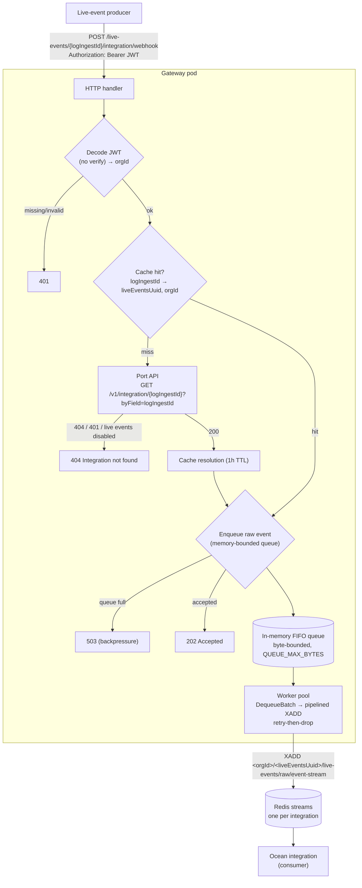

# ocean-gateway

Buffering gateway for Ocean live events. It receives live-event webhooks,
resolves each to its target integration, buffers events in a memory-bounded
in-process queue, and forwards them to a per-integration Redis stream that the
Ocean integration consumes.



## Flow

**Intake** — `POST /live-events/{logIngestId}/integration/webhook`

1. Extract `logIngestId` (path) and the bearer JWT (`Authorization` header).
2. Decode the JWT (no signature verification) to get `orgId`.
3. Resolve `logIngestId` → `liveEventsUuid` via an in-memory cache (1h TTL),
   falling back to the Port API
   `GET /v1/integration/{logIngestId}?byField=logIngestId` (the JWT is the
   bearer and validates ownership). `404`/`401`/live-events-disabled → `404`.
4. Enqueue the raw body. If the queue is at its memory bound → `503`. Else `202`.

**Forward** — a worker pool drains the queue and `XADD`s each event to:

```
<orgId>/<liveEventsUuid>/live-events/raw/event-stream
```

On Redis failure it retries with backoff, then drops (logged + counted).

## Run

```sh
REDIS_ADDR=localhost:6379 go run ./cmd/gateway
```

### Configuration (env)

| Var | Default | Description |
|-----|---------|-------------|
| `LISTEN_ADDR` | `:8080` | HTTP listen address |
| `PORT_API_BASE_URL` | `https://api.getport.io` | Port API base (US: `https://api.us.getport.io`) |
| `PORT_API_TIMEOUT` | `10s` | Port API request timeout |
| `REDIS_ADDR` | `localhost:6379` | Redis address |
| `REDIS_PASSWORD` | _(empty)_ | Redis password |
| `REDIS_DB` | `0` | Redis database |
| `QUEUE_MAX_BYTES` | `1073741824` | In-memory queue bound (1 GiB) |
| `WORKER_CONCURRENCY` | `8` | Forwarding worker goroutines |
| `QUEUE_BATCH_SIZE` | `500` | Max events drained per pipelined `XADD` round-trip |
| `CACHE_TTL` | `1h` | Integration resolution cache TTL |
| `REDIS_STREAM_MAXLEN` | `0` | Approx `MAXLEN` per stream (`0` = uncapped) |
| `FORWARD_MAX_RETRIES` | `3` | XADD retries before dropping |
| `FORWARD_BACKOFF_BASE` | `100ms` | Initial backoff (doubles per retry) |

## Test

```sh
go test ./... -race
```

## Load test

`cmd/loadtest` fires a burst of events at a running gateway, spread across N
orgs. Each org gets its own `logIngestId` **and** its own bearer JWT — the
gateway caches the `logIngestId → {liveEventsUuid, orgId}` resolution, so
sharing a `logIngestId` across orgs would collapse every event into the first
org's stream.

```sh
go run ./cmd/loadtest -url http://localhost:8080 -events 10000 -orgs 10 -concurrency 50
```

Flags: `-url`, `-events` (default 10000), `-orgs` (default 10), `-concurrency`
(default 50), `-log-ingest-prefix` (default `loadtest-ingest-`), `-timeout`.
It reports throughput, status-code breakdown, and latency percentiles. Org `i`
sends to `logIngestId = <prefix><i>` under `orgId = org_load_<i>`, so events
fan out to one stream per org. Inspect afterward with:

```sh
redis-cli --scan --pattern 'org_load_*/*/live-events/raw/event-stream'
```
