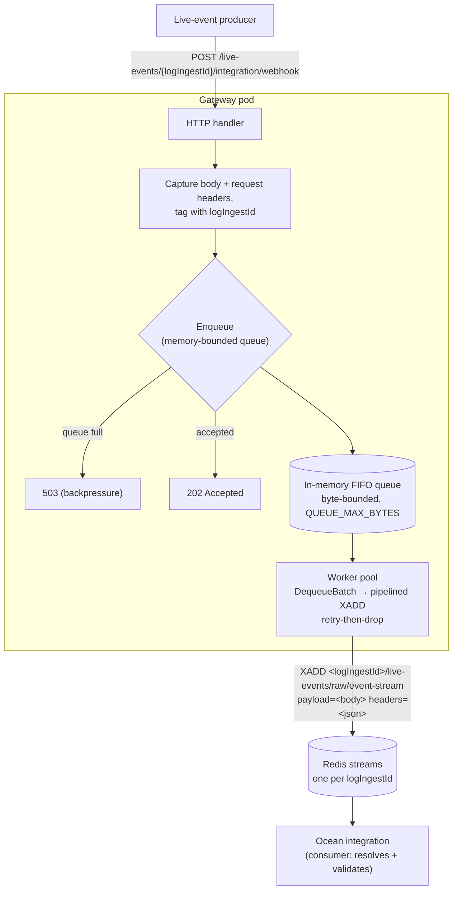

# ocean-gateway

Buffering gateway for Ocean live events. It receives live-event webhooks and
forwards them, untouched, to a per-`logIngestId` Redis stream that the Ocean
integration consumes. The gateway is a pure buffer: it does not authenticate,
resolve, or validate the event — the consuming integration does that when it
reads the stream.



## Flow

**Intake** — `POST /live-events/{logIngestId}/integration/webhook`

1. Extract `logIngestId` from the path.
2. Read the raw request body and capture the request headers.
3. Enqueue an event tagged with the `logIngestId`. If the queue is at its
   memory bound → `503`. Else `202`.

**Forward** — a worker pool drains the queue and `XADD`s each event to the
per-integration stream `<logIngestId>/live-events/raw/event-stream` (the `raw`
segment leaves room for other event classes later). Each entry has two fields:

| Field | Contents |
|-------|----------|
| `payload` | the raw request body, byte-for-byte |
| `headers` | the request headers, JSON object (`{"Header-Name":["value", ...]}`) |

On Redis failure it retries with backoff, then drops (logged + counted).

**Retention** — applied on every write:

- **Event TTL** (`EVENT_TTL`, default 1h): each `XADD` trims entries older than
  the TTL via `MINID`, so a stream holds roughly the last hour of events.
- **Stream idle TTL** (`STREAM_TTL`, default 1h): each write refreshes the
  stream key's `EXPIRE`, so a stream with no new events for the TTL is deleted
  entirely. Active streams never expire.

## Metrics

`GET /metrics` exposes Prometheus metrics:

| Metric | Type | Description |
|--------|------|-------------|
| `gateway_events_forwarded_total` | Counter | Events successfully written to Redis |
| `gateway_events_dropped_total` | Counter | Events dropped after Redis retry exhaustion |
| `gateway_queue_dequeued_total` | Counter | Events pulled from the buffer (use `rate()` for handling rate) |
| `gateway_queue_depth_events` | Gauge | Current number of events in the in-memory buffer |
| `gateway_queue_delay_seconds` | Histogram | Time each event spent waiting in the buffer before a worker picked it up |
| `gateway_event_e2e_seconds` | Histogram | End-to-end time from HTTP intake to successful Redis XADD |

## Run

```sh
REDIS_ADDR=localhost:6379 go run ./cmd/gateway
```

### Configuration (env)

| Var | Default | Description |
|-----|---------|-------------|
| `LISTEN_ADDR` | `:8080` | HTTP listen address |
| `REDIS_ADDR` | `localhost:6379` | Redis address |
| `REDIS_PASSWORD` | _(empty)_ | Redis password |
| `REDIS_DB` | `0` | Redis database |
| `QUEUE_MAX_BYTES` | `1073741824` | In-memory queue bound (1 GiB) |
| `WORKER_CONCURRENCY` | `8` | Forwarding worker goroutines |
| `QUEUE_BATCH_SIZE` | `500` | Max events drained per pipelined `XADD` round-trip |
| `REDIS_STREAM_MAXLEN` | `0` | Approx `MAXLEN` per stream, size-based (ignored when `EVENT_TTL` > 0; `0` = uncapped) |
| `EVENT_TTL` | `1h` | Trim stream entries older than this via `MINID` (`0` = no age trim) |
| `STREAM_TTL` | `1h` | Idle stream key expiry, refreshed on each write (`0` = no expiry) |
| `FORWARD_MAX_RETRIES` | `3` | XADD retries before dropping |
| `FORWARD_BACKOFF_BASE` | `100ms` | Initial backoff (doubles per retry) |

## Test

```sh
go test ./... -race
```

## Load test

`cmd/loadtest` fires a burst of events at a running gateway, spread across N
distinct `logIngestId` streams. Each request carries a JSON body and a couple
of headers, exercising both the `payload` and `headers` fields written to the
stream.

```sh
go run ./cmd/loadtest -url http://localhost:8080 -events 10000 -streams 10 -concurrency 50
```

Flags: `-url`, `-events` (default 10000), `-streams` (default 10),
`-concurrency` (default 50), `-log-ingest-prefix` (default `loadtest-ingest-`),
`-timeout`. It reports throughput, status-code breakdown, and latency
percentiles. Stream `i` uses `logIngestId = <prefix><i>`. Inspect afterward
with:

```sh
redis-cli --scan --pattern 'loadtest-ingest-*/live-events/raw/event-stream'
```
