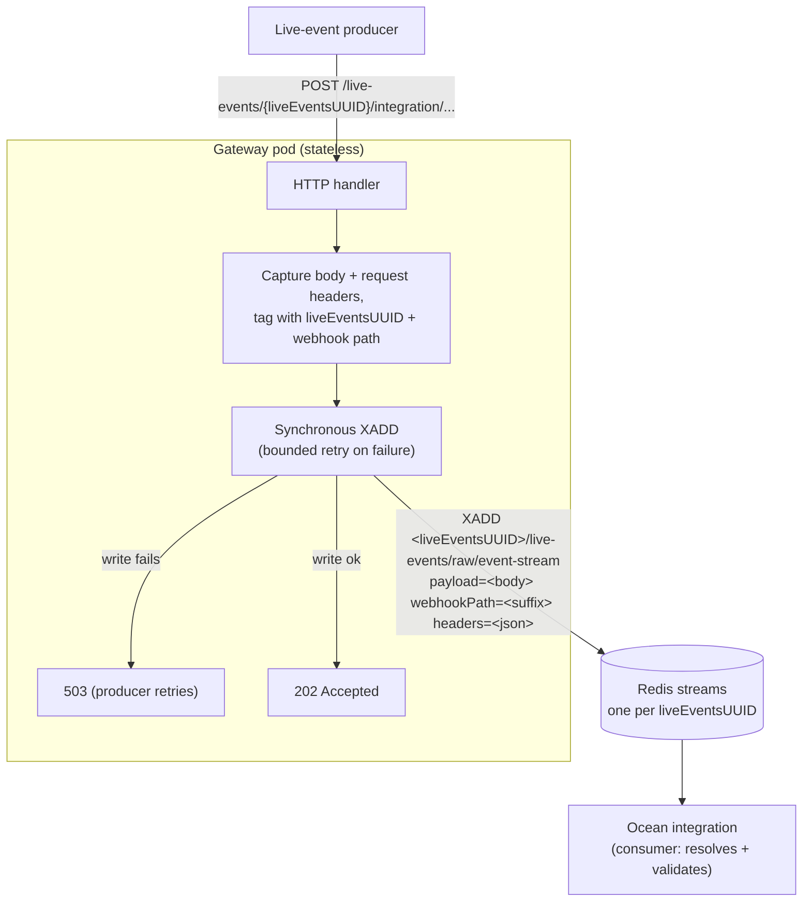

# ocean-gateway

[](https://github.com/port-labs/ocean-gateway/actions/workflows/ci.yml)
[](LICENSE)

Stateless gateway for Ocean live events. It receives live-event webhooks and
writes them, untouched, **straight to** a per-`liveEventsUUID` Redis stream that
the Ocean integration consumes. The gateway holds no buffer of its own — an
accepted event is durably in Redis before the `202` is returned, so a gateway
crash never loses data and pods scale horizontally with no coordination. It does
not authenticate, resolve, or validate the event; the consuming integration does
that when it reads the stream.



## Flow

Ocean integrations subscribe to provider webhooks at:

```
POST /live-events/{liveEventsUUID}/integration/{webhookSuffix}
```

`{webhookSuffix}` is the path each integration registers for its webhook
processor.
`POST /live-events/{liveEventsUUID}` with no suffix — but **Ocean's canonical
webhook URL always includes the `integration/` prefix**.

Everything after `{liveEventsUUID}/` is captured verbatim as `webhookPath` on
the stream entry. Different suffixes still write to the **same** stream for a
given UUID — only the `webhookPath` field differs:

| Request path | `webhookPath` stored |
|--------------|----------------------|
| `/live-events/{liveEventsUUID}/integration/webhook` | `integration/webhook` |
| `/live-events/{liveEventsUUID}/integration/pull-request` | `integration/pull-request` |
| `/live-events/{liveEventsUUID}/integration/github/webhook` | `integration/github/webhook` |
| `/live-events/{liveEventsUUID}` _(no suffix)_ | _(empty)_ |

The gateway does **not** normalize the suffix. Ocean's Redis stream consumer
strips the `integration/` prefix and routes to the registered processor — see
[webhookPath and Ocean routing](#webhookpath-and-ocean-routing) below.

1. Extract `liveEventsUUID` from the path (first segment after `/live-events/`).
2. Read the raw request body and capture the request headers.
3. `XADD` the event to `<liveEventsUUID>/live-events/raw/event-stream` (the `raw`
   segment leaves room for other event classes later). On a transient Redis
   error it retries with bounded backoff; on persistent failure it returns
   `503` so the producer retries. On success it returns `202`.

Each stream entry has four fields:

| Field | Contents |
|-------|----------|
| `payload` | the raw request body, byte-for-byte |
| `webhookPath` | the path suffix after `/live-events/{liveEventsUUID}/`, stored as-is (empty when none) |
| `headers` | the request headers, JSON object (`{"Header-Name":"value"}`; multiple values for one name are joined with `, `) |
| `queuedAt` | Unix nanoseconds (decimal string) stamped immediately before `XADD`; consumers subtract this from the `XREADGROUP` time to measure queue wait independent of processing duration |

### webhookPath and Ocean routing

The gateway only stores the URL suffix; it does not rewrite it. When an Ocean
integration reads the stream, its Redis consumer normalizes `webhookPath` before
matching a registered webhook processor (see
`port_ocean/consumers/redis_stream_consumer.py` in the Ocean repo):

1. Strip leading and trailing `/` characters.
2. Optionally strip an `integration/` prefix.
3. Prepend `/` and route to the processor registered at that path.

Do not assume every suffix is rewritten to `/webhook`. Arbitrary suffixes must
match a path the integration actually registered. When configuring provider
webhook URLs for on-prem, use
`/live-events/<liveEventsUUID>/integration/<webhookSuffix>`.

**Throughput** comes from concurrency, not an internal queue: each request does
its own `XADD` through the Redis connection pool, so many in-flight requests
parallelize naturally. Tune `REDIS_POOL_SIZE` to raise the concurrent-write
ceiling.

**Retention** — applied on every write:

- **Event TTL** (`EVENT_TTL`, default 1h): each `XADD` trims entries older than
  the TTL via `MINID`, so a stream holds roughly the last hour of events.
- **Stream idle TTL** (`STREAM_TTL`, default 1h): each write refreshes the
  stream key's `EXPIRE`, so a stream with no new events for the TTL is deleted
  entirely. Active streams never expire.

## Metrics

`GET /metrics` exposes Prometheus metrics:

| Metric | Type | Description |
|--------|------|-------------|
| `gateway_events_forwarded_total` | Counter | Events successfully written to Redis (use `rate()` for handling rate) |
| `gateway_events_failed_total` | Counter | Events that failed to write after retries (caller got a 503) |
| `gateway_inflight_requests` | Gauge | Requests currently blocked on a Redis write (saturation signal) |
| `gateway_redis_write_seconds` | Histogram | Duration of the Redis write (XADD round-trip, incl. retries) |
| `gateway_event_e2e_seconds` | Histogram | End-to-end time from HTTP intake to successful Redis write |

## On-premises webhook URL

When running Ocean on-premises, configure each integration's webhook URL to
point at your gateway using this path format:

```
/live-events/<liveEventsUUID>/integration/<webhookSuffix>
```

`<liveEventsUUID>` is the integration's live-events UUID. `<webhookSuffix>` is
the path the integration registered for that webhook processor (for example
`webhook`). Reuse the same `liveEventsUUID` across all provider-specific
webhook URLs that belong to the same integration. This ensures events from
multiple webhooks are written to a single dedicated Redis stream.

Events are always written to `<liveEventsUUID>/live-events/raw/event-stream`.
The URL suffix is stored on each entry as `webhookPath` so Ocean can route the
event to the correct webhook processor.

## Run

```sh
REDIS_URL=localhost:6379 go run ./cmd/gateway
```

### Configuration (env)

| Var | Default | Description |
|-----|---------|-------------|
| `LISTEN_ADDR` | `:8080` | HTTP listen address |
| `REDIS_URL` | `localhost:6379` | Redis address |
| `REDIS_PASSWORD` | _(empty)_ | Redis password |
| `REDIS_DB` | `0` | Redis database |
| `REDIS_POOL_SIZE` | `0` | Redis connection pool size; bounds concurrent writes (`0` = go-redis default, 10×GOMAXPROCS) |
| `REDIS_STREAM_MAXLEN` | `0` | Approx `MAXLEN` per stream, size-based (ignored when `EVENT_TTL` > 0; `0` = uncapped) |
| `EVENT_TTL` | `1h` | Trim stream entries older than this via `MINID` (`0` = no age trim) |
| `STREAM_TTL` | `1h` | Idle stream key expiry, refreshed on each write (`0` = no expiry) |
| `WRITE_MAX_RETRIES` | `2` | Per-request XADD retries before returning 503 |
| `WRITE_BACKOFF_BASE` | `50ms` | Initial backoff (doubles per retry) |

## Test

```sh
go test ./... -race
```

## Load test

`cmd/loadtest` fires a burst of events at a running gateway, spread across N
distinct `liveEventsUUID` streams. Each request carries a JSON body and a couple
of headers, exercising both the `payload` and `headers` fields written to the
stream.

```sh
go run ./cmd/loadtest -url http://localhost:8080 -events 10000 -streams 10 -concurrency 50
```

Flags: `-url`, `-events` (default 10000), `-streams` (default 10),
`-concurrency` (default 50), `-live-events-uuid-prefix` (default `loadtest-ingest-`),
`-timeout`. It reports throughput, status-code breakdown, and latency
percentiles. Stream `i` uses `liveEventsUUID = <prefix><i>`. Inspect afterward
with:

```sh
redis-cli --scan --pattern 'loadtest-ingest-*/live-events/raw/event-stream'
```

Or use the runner script which also prints a performance summary:

```sh
./scripts/loadtest.sh -e 1000000 -s 20 -c 100
```

## Consuming the streams

Integrations should use Redis Streams **consumer groups** (`XREADGROUP` + `XACK`)
rather than plain `XREAD`. This gives at-least-once delivery — messages stay
pending until acknowledged, and an integration that crashes mid-processing can
reclaim its work on restart via `XAUTOCLAIM`.

```sh
# Create a consumer group
redis-cli XGROUP CREATE "<liveEventsUUID>/live-events/raw/event-stream" ocean-integration $ MKSTREAM

# Read up to 100 pending messages
redis-cli XREADGROUP GROUP ocean-integration worker-1 COUNT 100 STREAMS \
  "<liveEventsUUID>/live-events/raw/event-stream" ">"

# Acknowledge after processing
redis-cli XACK "<liveEventsUUID>/live-events/raw/event-stream" ocean-integration <message-id>
```

## Producer contract

A `503` from the gateway means Redis is temporarily unavailable. The event was
**not** written. Producers must retry — the gateway has no internal buffer, so
a `503` is the backpressure signal. A `202` guarantees the event is durably in
the stream.

## Retention notes

`EVENT_TTL` and `STREAM_TTL` both default to `1h` and are independent:

- **`EVENT_TTL`** trims individual entries via `XADD MINID` on every write — a
  stream that receives events continuously will only ever hold the last hour's
  worth of events.
- **`STREAM_TTL`** is an `EXPIRE` refreshed on every write — a stream that
  receives no events for the TTL is deleted entirely. Set `STREAM_TTL` longer
  than `EVENT_TTL` if consumers may lag and you want idle streams to survive.

## Contributing

See [CONTRIBUTING.md](CONTRIBUTING.md).

